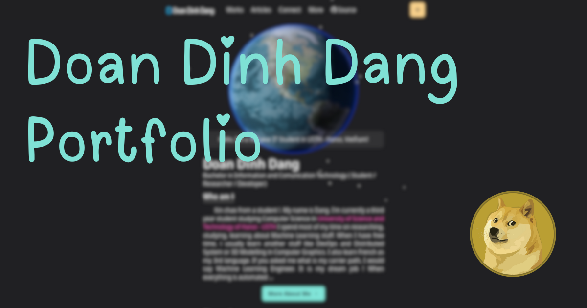

# D-Dev's Homepage

<https://www.dangdd.dev>

## Image

## Stacks

- [Next.Js](https://nextjs.org) - Full-stack [React](https://react.dev)
  framework for website, including hybrid static web generating, server
  rendering, and route pre-fetching, etc.
- [Chakra UI](https://v2.chakra-ui.com) - A simple, modular and accessible
  component library for React.
- [Framer Motion](https://www.framer.com/motion) - A production-ready
  motion (animation) library for React
- [Three.Js](https://threejs.org) - A 3D Library for JavaScript.
- [WebGL](https://en.wikipedia.org/wiki/WebGL) - JavaScript API for rendering interactive
  2D & 3D graphics on web browser, allowing GPU-Acceleration.

## CI/CD Workflow

- [Self deployment](./Self_deployment.md) - Use github action for automatically building image.
  - [Kubernetes](https://kubernetes.io) - Container orchestration system for automating application deployment, scaling, and management.
  - [MetalLB](https://metallb.universe.tf) - Load-balancer for Kubernetes.
  - [Cloudflare](https://www.cloudflare.com) - Proxy, CDN and DNS provider for domain management and security.
  - [Docker](https://www.docker.com) - Containerization tool.
  - [Traefik](https://traefik.io/traefik) - The cloud native application proxy used for reverse proxy, load balancer, tls connection (https).
  - [Watchtower](https://containrrr.dev/watchtower) - Automating Docker container base image updates.
- [Vercel](https://vercel.com) - Cloud platform for static sites and serverless functions, used for hosting the website.
- [Heroku](https://www.heroku.com) - Cloud platform for hosting applications, used for hosting the backend API.

## Credits

Thank [@craftzdog](https://github.com/craftzdog) for the theme and inspiration.
